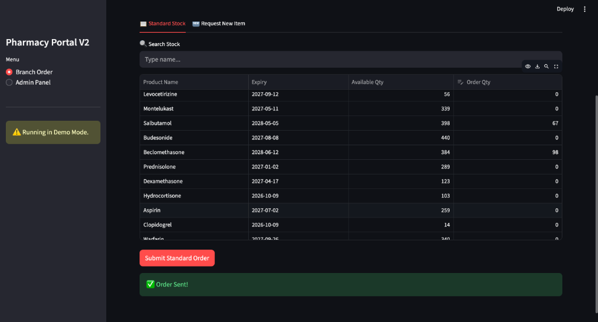
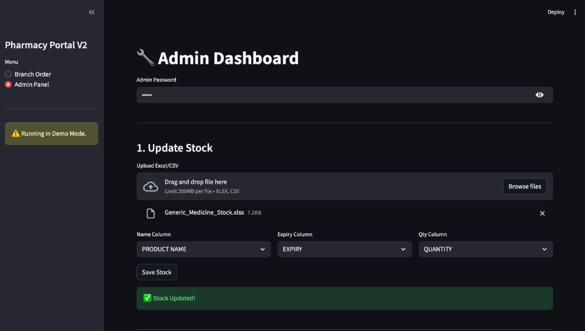
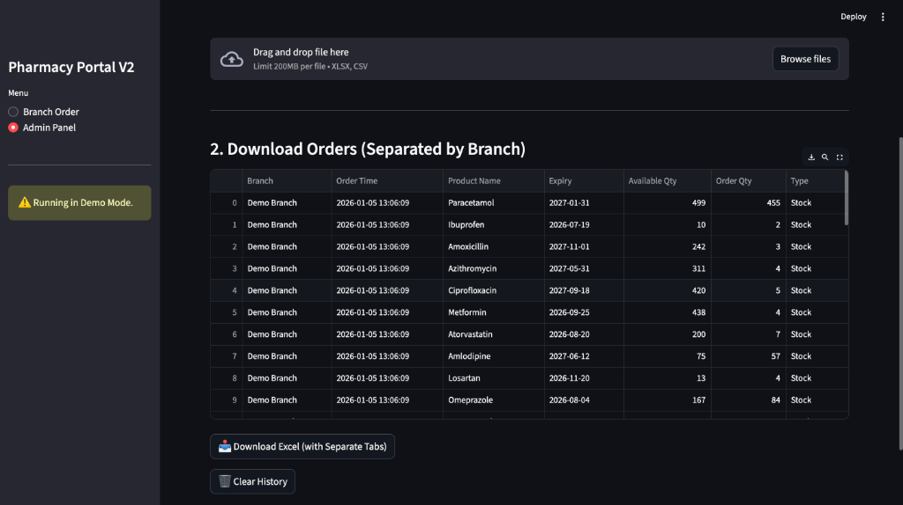
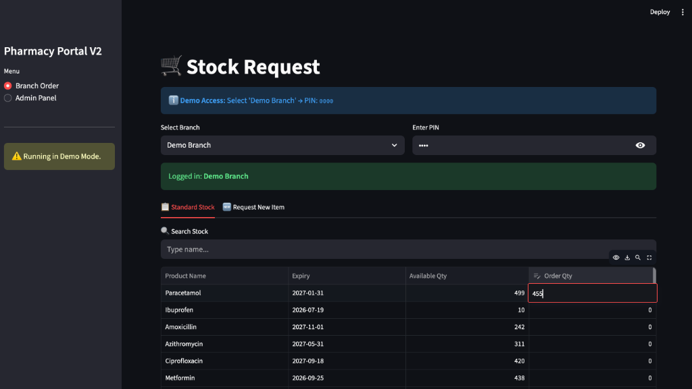
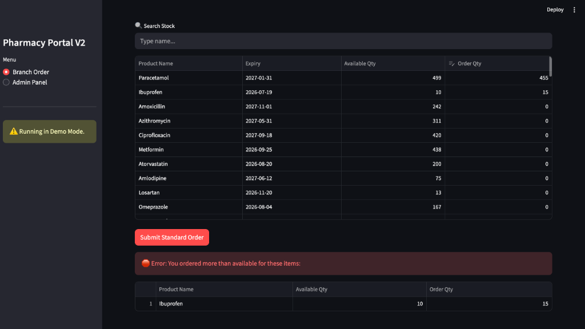

# 📖 Pharmacy Portal V2 - User Guide

This guide explains how to use the Pharmacy Order Portal V2 for daily operations.

---

## 👮 For the Admin (Main Branch)

### Morning Routine (8:00 AM)
1.  **Export Stock:**
    * Open your POS (e.g., eWF, iPharmacy).
    * Export the "Current Stock" report to Excel or CSV format.
2.  **Login:**
    * Select **Admin Panel** from the sidebar.
    * Enter the Admin Password.
3.  **Upload:**
    * Drag the Excel file into the "Upload" box.
    
4.  **Map Columns:**
    * Select the column that contains the **Product Name**.
    * Select the column for **Expiry Date**.
    * Select the column for **Quantity**.
5.  **Save:**
    * Click the **"Save & Update Stock"** button.
    * *Result:* All branches will immediately see the updated stock levels.

### Evening Routine (9:00 PM)
1.  **Login:** Go to **Admin Panel**.
2.  **Check Orders:** You will see a table displaying all requests received today.
3.  **Download:**
    * Click the **"📥 Download Excel"** button.
    * This downloads a file with separate tabs for each branch.
    
4.  **Clear:**
    * Once you have saved the file safely, click **"🗑️ Clear History"**.
    * This resets the system for tomorrow's orders.

---

## 🛒 For Branch Managers

### How to Order Stock
1.  **Open the App:** Click the link provided by your IT Administrator.
2.  **Login:**
    * Select your **Branch Name** from the dropdown list.
    * Enter your 4-digit **PIN**.
    
3.  **Search:**
    * Type a medicine name (e.g., "Panadol") in the search bar.
4.  **Order:**
    * Check the **"Available Qty"** to ensure the Main Branch has stock.
    * Type the number you need in the **"Request Qty"** box.
    * **Note:** The system will prevent you from ordering more than what is available.
    
5.  **Submit:**
    * Click the red **"Submit Standard Order"** button.
    * Wait for the "Success" message to appear.

### ❓ Troubleshooting
* **"Incorrect PIN":** You have entered the wrong password. Contact the Main Branch manager to reset it.
* **"Waiting for Admin...":** The Main Branch has not uploaded the stock file yet. Please call them.
